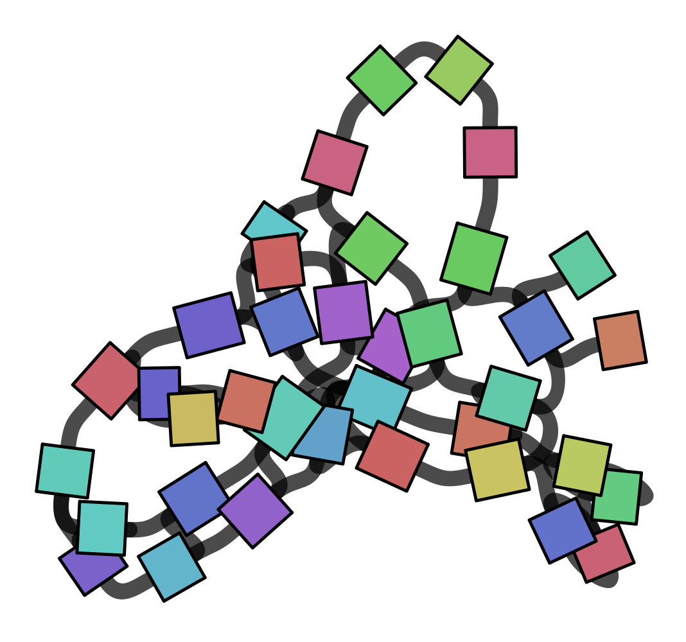
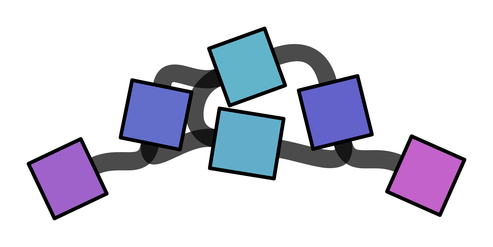
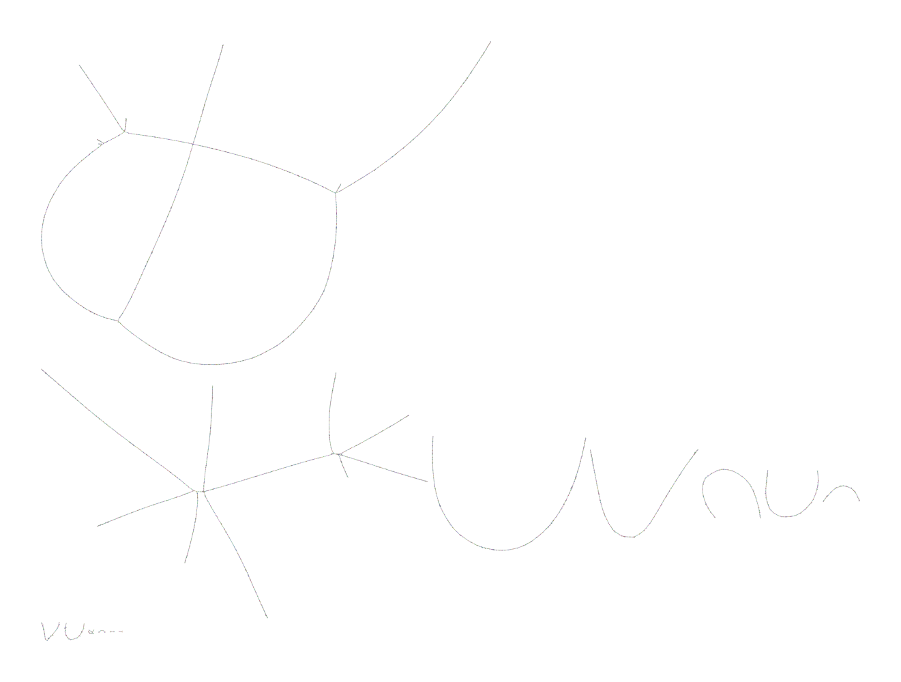
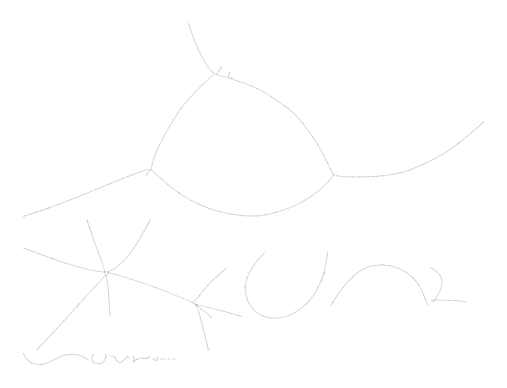

# Сборка генома с использованием графа де Брейна

## Описание решения
Решение реализует конвейер для построения, сжатия, очистки и визуализации графа де Брейна на Python без использования внешних зависимостей.

### Ключевые компоненты реализации:
1. **Парсинг данных**: Реализованы легковесные функции `read_fasta` и `read_fastq`, извлекающие нуклеотидные последовательности.
2. **Построение графа**: Класс `DeBruijnGraph` хранит в вершинах k-меры, а на ребрах – (k+1)-меры. Покрытие ребра определяется как количество вхождений данного (k+1)-мера.
3. **Сжатие графа**: Метод `compress()` объединяет линейные пути (где внутренняя вершина имеет `in_degree == 1` и `out_degree == 1`) в одно ребро. Начальная и конечная вершины сохраняются, а нуклеотидная последовательность контига накапливается на ребре. Покрытие ребра суммируется.
4. **Очистка графа**: Метод `clean_uncompressed()` применяет две эвристики:
   - Удаление ребер с глубиной покрытия ниже заданного порога (`min_cov`, удаляет редкие k-меры, возникшие из-за ошибок секвенирования).
   - Удаление коротких тупиковых ветвей длиной менее `max_tip_len_k1` ребер, которые начинаются или заканчиваются вершиной со степенью 0.
   - После очистки граф автоматически перестраивается и сжимается заново.
5. **Экспорт**: 
   - Контиги сохраняются в формате FASTA.
   - Граф сохраняется в формате **GFA1**, где вершины (`S`) представляют собой k-меры, а связи (`L`) содержат пользовательские теги `se:Z` (полная последовательность сжатого ребра) и `cv:i` (покрытие).

---

## Анализ данных и выводы

### 1. Графы де Брейна для референсного генома

#### `k = 15`

Граф представляет собой плотную сеть из множества вершин и рёбер. Видны циклы, развилки и «пузыри». Это связано с тем, что при `k = 15` k-меры слишком короткие и часто повторяются в разных участках генома. Даже небольшие повторы длиной ≥15 нуклеотидов создают альтернативные пути, поэтому граф не является линейным.

#### `k = 31`

При увеличении `k` до 31 уникальность k-меров возрастает. Граф становится значительно проще: количество вершин и ветвлений резко уменьшается, он приближается к линейному. Это отражает тот факт, что длинные k-меры позволяют разрешить большинство коротких повторов. Оставшиеся немногочисленные ветвления могут быть связаны с длинными повторами (например, оперонами рРНК, IS-элементами) или с границами контигов, если референс не был полностью собран в одну последовательность.

**Вывод по референсу:**  
Малые `k` дают высокую связность, но приводят к запутанной сети из-за коротких повторов. Большие `k` повышают специфичность и упрощают граф вплоть до почти линейного. Для референса без ошибок секвенирования граф отражает истинную структуру повторов, а выбор `k` — это компромисс между разрешением повторов и связностью.

---

### 2. Графы де Брейна для файла с прочтениями

Реальные прочтения содержат ошибки секвенирования и неравномерное покрытие, что порождает шум в графе.

#### `k = 21` (без очистки)

Граф содержит «пузыри» (альтернативные пути между вершинами) и короткие тупиковые ветви. Пузыри возникают из-за ошибок или повторов, а тупики — из-за ошибок, создающих уникальные (k+1)-меры с низким покрытием. Это типичная картина для неочищенного графа де Брейна по прочтениям.

#### `k = 21` (после очистки, `min_cov=1`, `max_tip_len_k1=5`)

После применения эвристик с порогом покрытия `min_cov=1` граф остаётся связным, но количество коротких тупиковых ветвей заметно уменьшается. Основные линейные пути, соответствующие истинным участкам генома, сохраняются. В отличие от `min_cov=2`, где граф распадался на множество изолированных фрагментов, здесь мы не теряем низкопокрытые истинные рёбра. Это критически важно для сборки при невысоком покрытии.

#### Сравнение `k = 15` и `k = 31` после очистки
- При `k = 15` очистка удаляет часть шума, но в графе всё ещё много сложных участков из-за коротких повторов.  
- При `k = 31` граф после очистки может фрагментироваться сильнее, так как длинные k-меры требуют большего покрытия для связности, и при низком покрытии многие истинные рёбра имеют coverage 1, которые мы теперь сохраняем, но общая структура становится более разреженной.  
- Оптимальным для данного набора можно считать `k = 21` с `min_cov=1` и удалением коротких тупиков: он обеспечивает хороший баланс между специфичностью и связностью.

**Итоговый вывод:**  
Для зашумлённых данных очистка графа необходима, но её параметры критически важны. Слишком высокий `min_cov` удаляет истинные низкопокрытые рёбра и приводит к фрагментации. Оптимальный `k` должен быть достаточно большим, чтобы уникально идентифицировать участки генома и подавлять случайные совпадения из-за ошибок, но достаточно малым, чтобы сохранять связность при неравномерном покрытии. Для данного набора данных разумный выбор — `k = 21` с `min_cov=1` и удалением коротких тупиков.